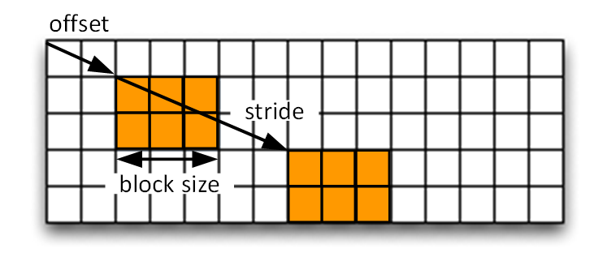
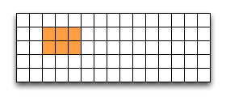

Practical: HDF5 basics
======================

This practical is an introduction to HDF5. It shows how to read existing HDF5 files, and how to create and modify your own files.

Before you start
----------------

.. install HDF5
.. pip install h5py

To set up the environment::

    module load anaconda hdf5parallel/1.10.1-gcc6-mpt214

Running the examples
^^^^^^^^^^^^^^^^^^^^

To run a Python example type the following::

    python tutorial.py

where 'tutorial.py' is the name of your python source.

Viewing the contents of an HDF5 file
^^^^^^^^^^^^^^^^^^^^^^^^^^^^^^^^^^^^

The commandline utility 'h5dump' allows to view the contents of a data file, like this::

    h5dump SampleFile.h5

For large datasets only the header data can be displayed::

    h5dump -H SampleFile.h5

There are many more options. See https://www.hdfgroup.org/HDF5/doc/RM/Tools.html#Tools-Dump for reference or display the help message::

    h5dump --help

Reading an existing HDF5 file
-----------------------------

In this section we’re going to read data from an existing HDF5 file.

View the contents
^^^^^^^^^^^^^^^^^

An HDF5 file has a container or tree structure, very similar to folders or directories in a Linux or Windows file system. The root container is always called “/”, just as in a file system, and containers may contain other containers.

The leaves of the tree (or "files" if we compare it to a file system) are datasets. A dataset has a header and a data array. The header contains information such as the name of the dataset, the dimensions of the data array, the type of its elements, other annotations and user-defined attributes.

To start with, download :download:`example.h5<_static/example.h5>` to your local file system::

    $ wget https://akrause2014.github.io/HDF5-Basics/python/html/_downloads/example.h5

We can have a look at its contents using 'h5dump':

.. code-block:: console

    $ h5dump example.h5
    HDF5 "example.h5" {
    GROUP "/" {
       DATASET "dset" {
          DATATYPE  H5T_STD_I32LE
          DATASPACE  SIMPLE { ( 6, 15 ) / ( 6, 15 ) }
          DATA {
          (0,0): 1, 2, 3, 4, 5, 6, 7, 8, 9, 10, 11, 12, 13, 14, 15,
          (1,0): 16, 17, 18, 19, 20, 21, 22, 23, 24, 25, 26, 27, 28, 29, 30,
          (2,0): 31, 32, 33, 34, 35, 36, 37, 38, 39, 40, 41, 42, 43, 44, 45,
          (3,0): 46, 47, 48, 49, 50, 51, 52, 53, 54, 55, 56, 57, 58, 59, 60,
          (4,0): 61, 62, 63, 64, 65, 66, 67, 68, 69, 70, 71, 72, 73, 74, 75,
          (5,0): 76, 77, 78, 79, 80, 81, 82, 83, 84, 85, 86, 87, 88, 89, 90
          }
       }
    }
    }

This file has one dataset which is located in the root container (GROUP "/") of the file.
The dataset is called "dset" and contains a 'SIMPLE' dataspace which is an array - in this case a 2-dimensional array of size (6, 15).
The type of the elements in the array is 'H5T_STD_I32BE', i.e. the values are 32-bit big-endian integers.

Accessing the file
^^^^^^^^^^^^^^^^^^

Now we’re going to write some code to open the data file and close it again::

    import h5py

    f = h5py.File('example.h5')
    print('Opened file')

This opens the file ‘example.h5’ and prints out a message. The options for creating or opening a file are:

**a**:
    opens an existing file for reading and writing or creates a new file otherwise. This is the default.
**w**:
    creates a new file or opens and overwrites an existing one
**r**:
    opens an existing file with read-only access
**r+**:
    opens an existing file for reading and writing
**w-/x**:
    creates a new file and fails if the file already exists

See http://docs.h5py.org/en/latest/high/file.html for more details.

To execute this example, create a file (for example ‘tutorial.py’) with the source code above and run it as explained in the section 'Before you start'.

Reading data
^^^^^^^^^^^^

Now modify the above example to read the data. As we have seen from the output of h5dump, there is one dataset called “dset” in the root group “/”. To read it we assign the dataset to a variable (this assumes that the file 'f' has been opened already)::

    dataset = f['dset']

Now you can read the dataset contents using the NumPy slicing syntax. For example to get the dataset entry at position (1,5) you select this::

    dataset[1, 5]

Here are a few more examples:

* the first row (row 0)::

      dataset[0][:]

* the column at position 3::

      dataset[..., 3]

See http://docs.h5py.org/en/latest/high/dataset.html#reading-writing-data for more details.

In our example (reading the h5dump output above) we know that the dataset has size (6, 15). Now can print out all the contents of the dataset to the command line, for example by iterating over the two dimensions in a nested loop or by printing each row.

Creating groups and datasets
----------------------------

This section shows how to modify the structure of an HDF5 file, how to create and write datasets, and how to attach
attributes to groups or datasets.

Creating groups
^^^^^^^^^^^^^^^

As we've seen above, the example we were reading has only one group, the root container "/". Now we’re going to to create a few more groups.

After opening the file and reading its contents, this is how you create a new group named 'Earthquake'::

    group = f.create_group("Earthquake")

Note that groups can be created using absolute paths or relative paths::

    laq = group.create_group("/Earthquake/Laquila")

This is the same as::

    laq = group.create_group("Laquila")

Now create the following group structure:

.. image:: _static/group_structure.png

You can view and check the group structure using h5dump.

Visting the group structure
^^^^^^^^^^^^^^^^^^^^^^^^^^^

We can also view the group structure by defining a function to recursively visit all objects in a group. For example to print the name of each group::

    def print_name(name):
        print(name)

    group.visit(print_name)

If the visit function returns any other value than None the recursion will stop. Now write a function that finds the group called "Laquila" or returns None if there is no such group.

Creating a new dataset
^^^^^^^^^^^^^^^^^^^^^^

Now we’re going to add a new dataset in the group “/Earthquake/Laquila/Traces”.
A dataset has a name and is characterised by its size, its shape (the shape of the array) and the datatype (the type of the stored elements).
For our scenario we are going to create a dataset that contains a 2-dimensional array of integers.

This is how to create a 2-dimensional array of dimensions (5, 10) with the name “day1” within the group “Laquila”::

    dataset = laq.create_dataset("day1", (5,10), dtype='i');

There are many predefined datatypes. The native type 'i' corresponds to a C int type. For example, on an Intel based PC, this type is the same as H5T_STD_I32LE.

Writing to a dataset
^^^^^^^^^^^^^^^^^^^^

Now you can fill the dataset with some data::

    dataset[(0,0)] = 23
    /* add more data (integer values) to the array here */
    ...

Try to create more datasets in various groups and write to and read from them. You can always check the contents of your HDF5 file using h5dump.

Attributes
^^^^^^^^^^

Attributes can be attached to HDF5 datasets or groups. An attribute has two parts: a name and a value. See http://docs.h5py.org/en/latest/high/attr.html for more information. Attributes are defined with a dataspace and type in the same way as datasets.

Let’s create a string attribute for the root group of our HDF5 file, stating the author::

    value = "Amy Krause"
    f.attrs['author'] = value

The attribute is named ‘author’ and the dataspace and data type are determined by reflection - in this case it is a scalar dataspace (one element) of type String.
You can also create attributes with values that are arrays.

Now add an attribute to the dataset that you created above, within group ‘Laquila’, using the same technique, to attach a timestamp to your dataset.
Remember to use dataset object instead of the file object if you create an attribute for a dataset, or the group object if you're attaching an attribute to a group.

Modifying the HDF5 file structure
---------------------------------

An HDF5 file is structured just like a file system, with directories or folders (called containers) and files (called datasets).
The library allows to modify this structure in the same way as you can modify a file system.

Moving a dataset
^^^^^^^^^^^^^^^^

You can easily move the dataset "dset" from the root container into the container "/Earthquake/Laquila/Traces/" by calling move on a group or a file, using absolute paths or relative paths.
The following also renames the dataset from "dset" to "day2"::

    f = h5py.File('example.h5')
    f.move("dset", "Earthquake/Laquila/Traces/dset")

    group = f['Earthquake/Laquila/Traces/']
    group.move("dset", "day2")

Symbolic links
^^^^^^^^^^^^^^

It is also possible to create symbolic links to point to objects in other locations in the HDF5 file structure.
Linked objects can be groups or datasets.
For example, create a soft link to the dataset created above from within another group::

    f["target"] = h5py.SoftLink('/source')

The source name is either an absolute path of the source of the link, or it a relative path within a group. Now create a symbolic link to the dataset "Earthquake/Traces/dset" from some other location within the file structure.

External links
^^^^^^^^^^^^^^

External links are links from an HDF5 file to an object in another HDF5 file.
Once created the external object behaves like it is part of the file.

Download the dataset :download:`NapaValley.h5<_static/NapaValley.h5>`.
Then link a group 'Earthquake/NapaValley/' in your file to the group 'Traces' in the external file::

    f[SOURCE_GROUP] = h5py.ExternalLink(<TARGET_FILE>, <TARGET_GROUP>)

In the command above replace `TARGET_GROUP` with the group in the external file and `SOURCE_GROUP`
with a new group in your file that points to the external group.
Now you can read this new group as if it was part of the source HDF5 file.

Partial I/O
-----------

Regions and hyperslabs
^^^^^^^^^^^^^^^^^^^^^^

As HDF5 is commonly used when writing or reading files in a parallel application,
it is possible to select certain elements of a dataset rather than the whole array,
thus allowing to write different portions of a file or dataset from each process.
Regions of a dataset are called hyperslabs.

.. image:: _static/hyperslab2.png

For example you would use this when writing an MPI application in which data is distributed across processes.
As shown below each row (or column) of a shared array is read by a different process
and each process calculates a result from this data and writes it to a shared output file.
The selection of hyperslabs provides you with a view of the dataset region that each process reads or writes,
without having to worry about the physical location in the file or its shape and size.
The HDF5 library also supports the selection of independent elements of a dataset and creating unions of selections.
It uses numpy indexing and slicing notation for selecting rows, columns or any other subset of a multi-dimensional array.
See http://docs.scipy.org/doc/numpy/reference/arrays.indexing.html
for reference.

An HDF5 hyperslab is defined by the parameters:

    * offset
    * stride
    * count (the number of blocks)
    * block size

In the following example, select a slice of the dataset you created above, for example::

    d = dataset[1:3, 2:5]

This selects the slice (in this case a rectangle) of size (2,3) located at position (1,2) in the array, like this:

You can also change the size of blocks and the stride between the blocks, for example::

    d = dataset[1:8:3, 2:9:3]

To modify the dataset you assign an array to the selected region::

    dataset[1:3, 2:5] = [[0,0,0], [0,0,0]]

Remember that the array that you're writing must be the same size as the region that you select!

Use `h5dump` to check how the dataset looks now. Which elements have been replaced by new ones?

Slices
^^^^^^

You can read or write a whole column or row of a dataset by selecting a slice using the notation ":". The example below selects the first row of our dataset::

    dataset[0,:]

If there are more dimensions then you have to add ":" for each of them, for example::

    multidim_dataset[:,4,:,:]

Or you can combine slices and regions::

    dataset[0:4,:]

The above selects the first 4 rows of the dataset.

Try reading and writing a few more slices and hyperslabs of the dataset and check with `h5dump` how it behaves.

Advanced indexing
^^^^^^^^^^^^^^^^^

You can also select single elements from a dataset, for example to write a sequence of points::

    dataset[(0,0), (3,3), (3,5), (5,6)] = [1, 2, 3, 4]

For any axis you can select a list of points::

    dataset[0, [0,3,5]]
    dataset[0:5, [1,2,3]]

What are the shapes of the resulting arrays in the above examples? Now select the subarray of rows 0, 2 and 5 and all columns except the first and the last. What is the correct indexing expression for this?
